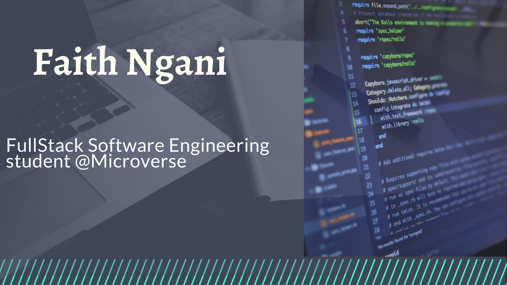

# Hi, I'm Ngani

I am a very passionate software engineer who is passionate about using data to solve real life issues in my society especially medical data.

I hope work as a Data Scientist dealing with medical data on common illness that go on trace.

# Languages and Tools

# I'm currently working on ...

Bulding simple projects with Javascript in order to improve my skills on problem solving.

# I'm currently learning

Learning React and Redux as part of my bootcamp curriculum while taking part in the Google Africa Developer Scholarship (GAD) for web specialist certification.

## Contact Info

- Email: nganifaith@gmail.com
- Twitter: [@Bright_Ngani](https://twitter.com/bright_ngani)
- LinkedIn: [Kongnyu Faith Ngani](https://www.linkedin.com/in/ngani-faith/)

Apart from being an engineer I love teaching and sharing with people it gives me much joy to share and help people.

# My famous Quotes

### A Random act of kindness can go a long way in changing the world.

### Always wear a smile for your smile might just brighten someone's day.
